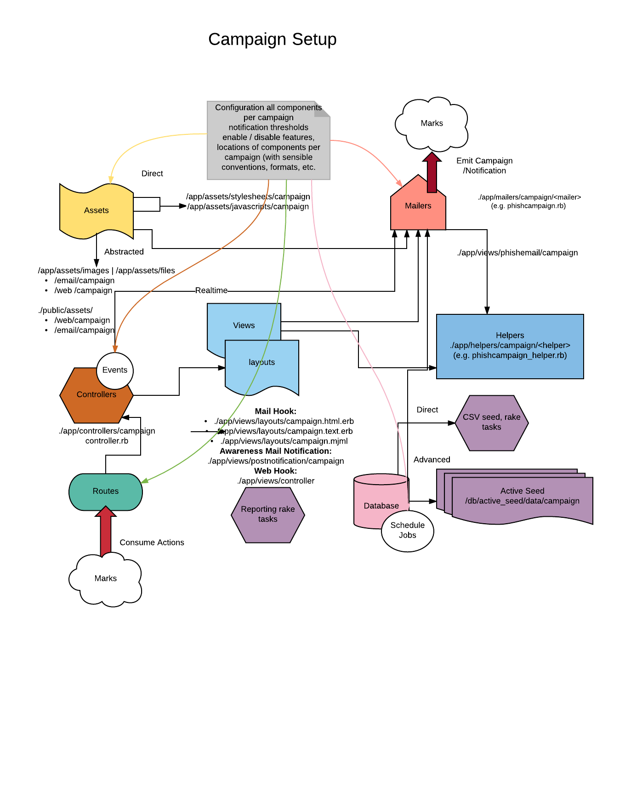

# RedPhin
## _Phishing and Awareness Framework_ 


## Goals:
* Reference implementation of what could a phishing framework be for folks who like full control over execution, don't mind writing templates and extend functionality.

_Comes with some reasonable scaffolding and sensible defaults._

* Provide just enough layer of abstraction over creating actionable phishing campaigns. 
  * Testers to have full control over content, layout, delivery, deployment of phishing emails, and accepting mark actions.
  * Attempts to be less fingerprintable by defense.

* Support both targeted offensive phishing, and awareness campaigns.
   Offensive support capabilities:
     * Attachments (files), unlimited number, unlimited format.
     * Ability to run multiple distinct campaigns with separate storyboards for both email and mark action intake.
     * Randomizes individual URLs per mark (attribution).
     * Throttling for Mail delivery per campaign.
     * Restart of email campaign. Long running campaign can be stopped and resumed.
     * Beaconing capability.
     * Proper format of HTML and Text multipart emails.
     * Responsive email support (80 %). Experimental support for responsive email reachning 100% 
     * _Ability to lock multiple visits and submissions to the same resource (anti-IR)_

   Awareness support capabilities:
     * Multiple campaigns
     * Realtime or delayed notification of actions to marks and/or to third party email.
     * Scheduled deployment of phishes
     * Statistics on visits, submissions, per mark.
     * Notification thresholds: number of visits, number of submissions.

   General capabilities
     * Per campaign styling of emails and web views. Separate styling of emails and web in the same campaign if needed.
     * Support of TLS via NGINX. 
     * Centralized configuration of components and mode features. 

* Play into "Full stack" phishing.
     * Portable. Get in, build, phish, get out. 
     * Full stack phishing docs TBD.  
	* SPF/DKIM. DevOps build scripts, etc.

* Reports are done via scripting (rake tasks), no frontend portal. Write your code as you like.
   * Examples and use cases given


```
Note: There are many great phishing frameworks out there. You should probably look into them first.
I have not used any of them except for the early versions of SET. I hear good things about:

* https://github.com/securestate/king-phisher
* https://getgophish.com/
* https://www.phishingfrenzy.com/
* https://github.com/trustedsec/social-engineer-toolkit

```

## Architecture
Work needs to be done on writing installation and operation manual but see  below (also in [Architecture and Composition Overview](docs/RedPhin-ProjectStructure.pdf) ).



### Composition (annotated)
```
├── app
│   ├── assets
│   │   ├── images
│   │   │   ├── emails                                       # setup for mail
│   │   │   │   └── campaign_tr                              # per campaign images
│   │   │   │       ├── logo1.png
│   │   │   │       └── logo2.png
│   │   │   └── web                                          # setup for web intake
│   │   │       └── campaign_tr                              # per campaign images
│   │   │           └── wstlogo.png
│   │   ├── javascripts
│   │   │   ├── application.js
│   │   │   └── campaign_tr                                  # per campaign JS
│   │   │       └── trnotifications.js
│   │   └── stylesheets                                      # per campaign styles
│   │       ├── application.css.scss
│   │       ├── campaign_tr
│   │       │   └── trnotifications.css.scss.erb
│   │       └── email.css.scss                               # style for email (html). mjml is not governed by theis
│   ├── controllers
│   │   ├── application_controller.rb
│   │   ├── concerns
│   │   └── trnotifications_controller.rb                    # campaign controller
│   ├── helpers
│   │   ├── application_helper.rb
│   │   └── campaign_tr
│   │       └── phishcampaign_helper.rb                      # phish mailer helper per campaign
│   ├── jobs
│   │   └── campaing_tr                                      # per campaign notification jobs
│   │       ├── delayed_notification_job.rb
│   │       └── realtime_notification_job.rb
│   ├── mailers
│   │   └── campaign_tr                                       # per campaign mailers
│   │       └── phishcampaign.rb
│   ├── models                                                # models
│   │   ├── concerns
│   │   ├── mark.rb
│   │   ├── stat.rb
│   │   └── visit.rb
│   └── views
│       ├── layouts
│       │   ├── application.html.erb
│       │   └── campaign_tr.html.erb                          # per campaign layout (web)
│       ├── phishemail                                        # per campaign content (email:phish)
│       │   └── campaign_tr
│       │       ├── content.html.erb
│       │       ├── content.mjml
│       │       └── content.text.erb
│       ├── postnotification
│       │   └── campaign_tr                                    # per campaign content (email:notification)
│       │       ├── content.html.erb
│       │       └── content.text.erb
│       └── trnotifications                                    # per campaign controller views for web
│           ├── _disclaimer.html.erb
│           ├── enotify.html.erb
│           ├── index.html.erb
│           ├── show.html.erb
│           ├── status_fail_logon.html.erb
│           ├── status_locked_submissions.html.erb
│           ├── status_locked_visits.html.erb
│           └── status_thank_you.html.erb
├── bin
│   ├── bundle
│   ├── rails
│   ├── rake
│   └── spring
├── config
│   ├── application.rb
│   ├── boot.rb
│   ├── configatron                                   # Configuration per campaign
│   │   ├── defaults.rb
│   │   ├── development.rb
│   │   └── production.rb
│   ├── cronotab.rb                                   # Scheduled tasks (cron)
│   ├── database.yml
│   ├── environment.rb
│   ├── environments
│   │   ├── development.rb
│   │   ├── production.rb
│   │   └── test.rb
│   ├── initializers
│   │   ├── assets.rb
│   │   ├── backtrace_silencers.rb
│   │   ├── configatron.rb
│   │   ├── cookies_serializer.rb
│   │   ├── filter_parameter_logging.rb
│   │   ├── inflections.rb
│   │   ├── log_formatter.rb
│   │   ├── mime_types.rb
│   │   ├── premailer_rails.rb
│   │   ├── session_store.rb
│   │   ├── sidekiq.rb
│   │   └── wrap_parameters.rb
│   ├── locales
│   │   └── en.yml
│   ├── routes.rb                                     # per campaign routes
│   └── secrets.yml
├── config.ru
├── customlog.log
├── data
│   └── marks.csv                                     # CSV mark importer (direct)
├── db
│   ├── active_seed
│   │   ├── data
│   │   │   └── tr_campaign                           # per campaign CSV importer (advanced)
│   │   │       └── marks.csv
│   │   ├── development.yml
│   │   └── production.yml
│   ├── production.sqlite3
│   ├── schema.rb
│   └── seeds.rb
├── Gemfile
├── lib
│   ├── assets
│   └── tasks                                         # useful and common tasks
│       ├── manage_marks.rake
│       ├── read_qs.rb
│       └── run_phish.rake
├── log
│   ├── development.log
│   └── production.log                                # logs
├── ops
│   ├── read_qs.rb
│   └── reset_data.sh
├── public
│   ├── 404.html
│   ├── 422.html
│   ├── 500.html
│   ├── assets
│   │   ├──<dynamic precompiled>
│   │   ├── emails
│   │   │   └── campaign_tr
│   │   │       ├── <dynamic precompiled>
│   │   │       └──<dynamic precompiled>
│   │   └── web
│   │       └── campaign_tr
│   │           └── <dynamic precompiled>
│   ├── favicon.ico
│   └── robots.txt
├── Rakefile
├── README.rdoc
├── tmp
└── vendor
    └── assets
        ├── javascripts
        └── stylesheets
```
## Installation

Documentation  _TBD_

At a minimum
```
$git clone <repourl>

$RAILS_ENV=production rake db:create

$RAILS_ENV=production db:schema:load

```

## Execution

Documentation  _TBD_
```
rake marks:email_phish[campaign,force]            # Email Marks
rake marks:generate_marks[campaign,number_users]  # Generate Mock-up marks <campaign, number_of_marks>
rake marks:list_campaigns                         # List Campaigns
rake marks:load_marks[csv_file]                   # Load Marks from CSV
rake marks:marks_delete[campaign]                 # Clean Marks table
rake marks:show_marks[campaign]                   # Show Marks
rake marks:visits_show                            # Show Visits and Submissions
rake marks:visits_show_alpha                      # Show Visits and Submissions - alphabetical

```

## Configuration

Documentation TBD 

Sample Campaign Block (replicate for multicampaign)

```ruby
### Campaigns we will run for the customer,
# You can add more than one campaign
# Setup each config vars in the campaign block

configatron.campaigns.trcampaign do |trcampaign|

  # Name of the campaign, affects how we find templates
  trcampaign.name='campaign_tr'

  #::::  Phishing Email Campaign Delivery
  # Email Message SECTION
  # This section is to configure some of the email massage presentation and construction
  trcampaign.email do |email|

    # First LOGO. Repeat for as many logos you want to place in email message.
    # Be mindful to work with Phish Controller to attach them properly in the email message
    # Logo of the sender company (upper tab)
    email.images.logo.first.name = 'logo1.png'
    # Size of the logo in email
    email.images.logo.first.size = '100x100'
    # logo file on disk
    email.images.logo.first.location =
        Configatron::Delayed.new {
          "#{Rails.root}/app/assets/images/emails/#{trcampaign.name}/#{email.images.logo.first.name}" }

    email.images.logo.second.name = 'logo2.png'
    email.images.logo.second.size = '50x50'
    email.images.logo.second.location =
        Configatron::Delayed.new {
          "#{Rails.root}/app/assets/images/emails/#{trcampaign.name}/#{email.images.logo.first.name}" }


    # How this email message is delivered
    # From:
    email.message.from = 'Some One <information@crainesbusiness.com>'
    # Subject:
    email.message.subject = 'Subject of Interest'
    # Which email template we are using for this campaign, and where to find it
    email.message.template.path = ['phishemail',trcampaign.name].join('/')
    email.message.template.name = 'content'


    # How are we building links to phisher stager web site
    # http://<addr>:<port>/<controller>/..id../<action>
    # Note: 'id' is the notification_tag which wil be filled in by the phishmailer
    # We do not manage SSL on the app server. This is done through nginx
    email.links.hserver.addr = 'crainesbusiness.com'
    email.links.hserver.port  = '80'
    email.links.hserver.controller  = 'trnotifications'
    email.links.hserver.action  = 'show'

  end

  # Web visit SECTION
  # This describes what the mark does on the phishing stager server, and how we respond to mark;s actions
  # This is also per campaign, obviously

  # Website itself
  trcampaign.web do |web|

    # How we find top-level phsihing company image(s). Same logic as 'email': name, location, size to
    # properly format the page. You may also work with semantic layout in the individual views
    web.images.logo.first.name = 'logo1.png'
    web.images.logo.first.location = ['web', trcampaign.name, web.images.logo.first.name].join('/')
    web.images.logo.first.size = '100x100'

    web.layout.window.title = 'Title Of Webpage'
    web.layout.headers.first.content = 'Content Header'
    web.layout.footers.copy.content = 'Copyright'

  end

  # How we respond to mark's visit actions, how and who we notify.
  # Example: Do we continue to accept visits/submission from the same mark or implement threshold logic.
  trcampaign.web.visits  do |visits|
    # Do we implement locks on visits to the submission form?
    visits.lock = false
    # if we do -  what is the number of visits allowed per mark
    visits.lock_threshold  = 9999

    # Do we make realtime awareness of the steps users take?
    # REALTIME:
    # When user visit how many visits does it take to notify the party
    visits.realtime.respond  = false
    visits.realtime.email.threshold  = 1
    # TODO: BATCH check implement
    # Do we make delayed/scheduled awareness of the steps users take?
    # When user visit how many visits does it take to notify the party
    visits.delayed.respond  = false
    visits.delayed.email.threshold  = 1
  end

  # How we respond to mark's submissions, not visits.
  trcampaign.web.submissions  do |submissions|
    # Do we implement locks on submissions?

    submissions.lock = true
    # if we do - what is the number of submissions allowed
    # Example: When user submits data how many submits does it take to notify parties of an attempt
    submissions.lock_threshold  = 1

    # Do we want to affect locks of page visits to prevent showing the submission form after submission is already made?
    submissions.lock_visits_after_submission = false

    # Do we make realtime awareness of the submissions?
    # REALTIME:
    # When user submits, how many submits  does it take to notify the party, correlate with lock_threashold to make sense.
    submissions.realtime.respond  = false
    submissions.realtime.email.threshold  = 1

    # TODO: Add checks for BATCH notification.
    # TODO: Currently we implement batch notification by default at the end of the day.
    # Do we make delayed/schtruled awareness of the submissions users take?
    # When user submits, how many submits does it take to notify the party
    submissions.delayed.respond  = false
    submissions.delayed.email.threshold  = 1
  end


  ## When we send post-phishing notification, how do we do it?
  trcampaign.post.email.delivery.every.day = 1.day
  trcampaign.post.email.delivery.at.time =  '22:30'
  trcampaign.post.email.message.from = 'Security Notification <notification@example.com>'
  trcampaign.post.email.message.subject = 'Social Engineering Test Results'
  # Where we find email template that will be sent?
  trcampaign.post.email.template.path = ['postnotification',trcampaign.name].join('/')
  trcampaign.post.email.template.name = 'content'


end
# redirect for all campaigns for this customer
configatron.web.rdr = 'http://example.com'
```
